# Framework Comparison

Quark was built after a source-level study of every major agentic framework. This page documents that research — the loop structures, stop signals, and state management patterns across 15 frameworks — and explains why Quark makes the choices it does.

## The Universal Pattern

Every framework, regardless of abstraction level, reduces to the same irreducible loop:

```
1. Build messages (system + user + history)
2. Call LLM
3. If response has tool calls → execute tools → append results → go to 2
4. If response has no tool calls → return final answer
```

Everything else is instrumentation, convenience, or safety rails around this core. Quark exposes this core directly.

---

## Frameworks Ranked by Monthly PyPI Downloads

> Data from pypistats.org, March 2026. Includes CI/CD, mirrors, and transitive deps.

| Rank | Framework | PyPI Package | Monthly Downloads | GitHub Stars |
|------|-----------|-------------|-------------------|--------------|
| 1 | LangChain | `langchain` | ~223M | 128k |
| 2 | LangGraph | `langgraph` | ~39M | 26k |
| 3 | OpenAI Agents SDK | `openai-agents` | ~14M | 19k |
| 4 | Pydantic AI | `pydantic-ai` | ~13M | 15k |
| 5 | Prefect | `prefect` | ~10M | 22k |
| 6 | LlamaIndex | `llama-index` | ~9.5M | 47k |
| 7 | Instructor | `instructor` | ~8.8M | 12k |
| 8 | DSPy | `dspy` | ~6.2M | 33k |
| 9 | CrewAI | `crewai` | ~5.4M | 45k |
| 10 | Strands Agents | `strands-agents` | ~5.5M | 5.3k |
| 11 | Agno | `agno` | ~1.3M | 38k |
| 12 | AutoGen | `autogen-agentchat` | ~883k | 55k |
| 13 | Haystack | `haystack-ai` | ~570k | 24k |
| 14 | smolagents | `smolagents` | ~440k | 26k |
| 15 | ControlFlow | `controlflow` | ~16k | ~800 |

---

## Agentic Loop Structures

### LangChain (AgentExecutor)
`while self._should_continue(iterations, time_elapsed)`

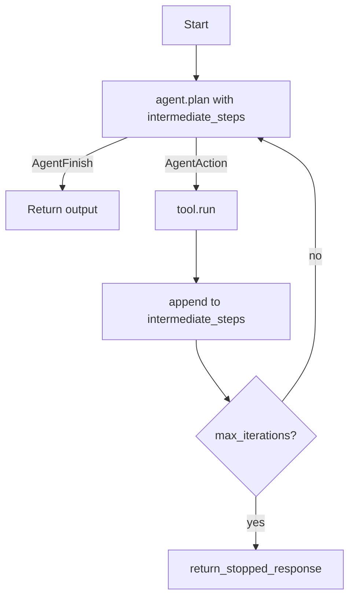

```python
intermediate_steps = []
for _ in range(max_iterations):  # default: 15
    output = agent.plan(intermediate_steps, **inputs)
    if isinstance(output, AgentFinish):
        return output.return_values
    observation = tools[output.tool].run(output.tool_input)
    intermediate_steps.append((output, observation))
return agent.return_stopped_response("force", intermediate_steps)
```

Stop: `AgentFinish` (parser detects `"Final Answer:"` token), `max_iterations`, `max_execution_time`.

---

### LangGraph (Pregel)
`while loop.tick()` — Google Pregel superstep model

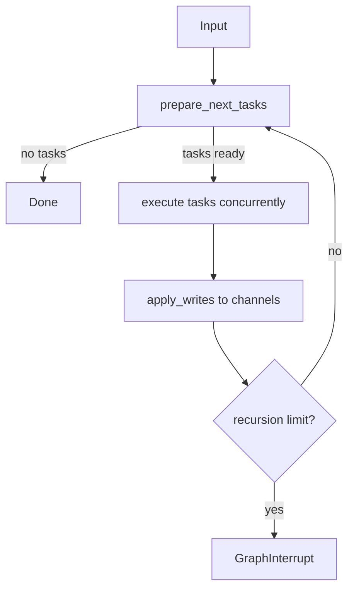

```python
with SyncPregelLoop(input, nodes=nodes, config=config) as loop:
    runner = PregelRunner(submit=loop.submit, put_writes=loop.put_writes)
    while loop.tick():
        for _ in runner.tick(loop.tasks.values()):
            pass
        loop.after_tick()
```

Not a traditional agentic loop — it's a graph execution engine. The "loop" is implicit in the graph topology.

---

### OpenAI Agents SDK
`while True:` with `current_turn` counter

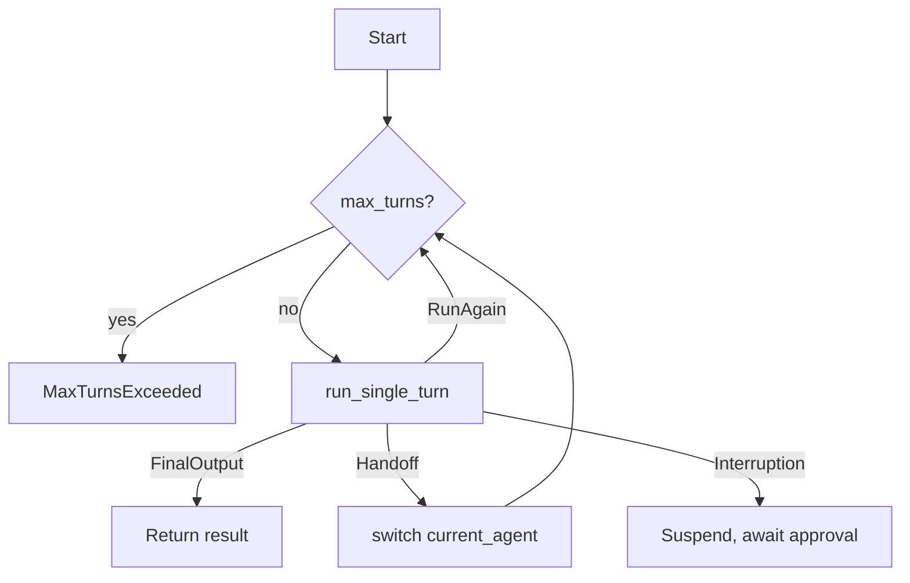

```python
while True:
    current_turn += 1
    if current_turn > max_turns:
        raise MaxTurnsExceeded()
    turn_result = await run_single_turn(agent, all_tools, generated_items, ...)
    if isinstance(turn_result.next_step, NextStepFinalOutput):
        return RunResult(...)
    elif isinstance(turn_result.next_step, NextStepHandoff):
        current_agent = turn_result.next_step.new_agent
    elif isinstance(turn_result.next_step, NextStepRunAgain):
        pass  # tool results fed back, continue
```

Stop: `NextStepFinalOutput`, `max_turns` (default 10), guardrail tripwire, interruption.

---

### PydanticAI
Graph node traversal — `while not isinstance(node, End)`

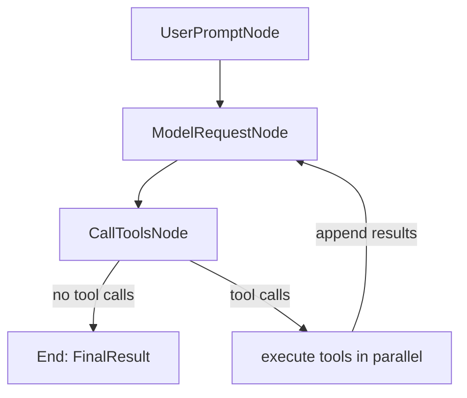

```python
current_node = input_node
while not isinstance(current_node, End):
    current_node = await current_node.run(GraphRunContext(state=state, deps=deps))
return current_node.output
```

---

### CrewAI
`while not isinstance(formatted_answer, AgentFinish)`

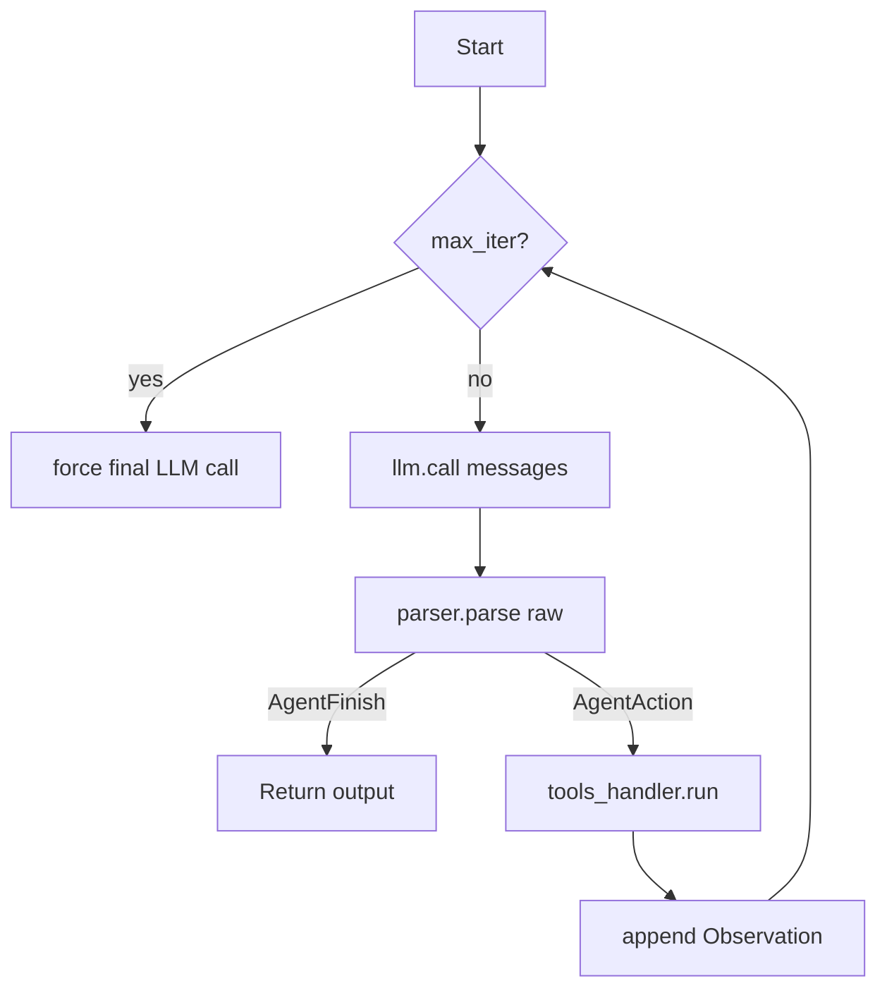

```python
while not isinstance(formatted_answer, AgentFinish):
    if has_reached_max_iterations(self.iterations, self.max_iter):
        break
    raw = llm.call(messages)
    formatted_answer = parser.parse(raw)
    if isinstance(formatted_answer, AgentAction):
        result = tools_handler.run(formatted_answer.tool, formatted_answer.tool_input)
        messages.append({"role": "user", "content": f"Observation: {result}"})
    self.iterations += 1
```

Stop: `"Final Answer:"` token, `max_iter` (default 20), `result_as_answer=True` tool.

---

### smolagents
`while not returned_final_answer and step_number <= max_steps`

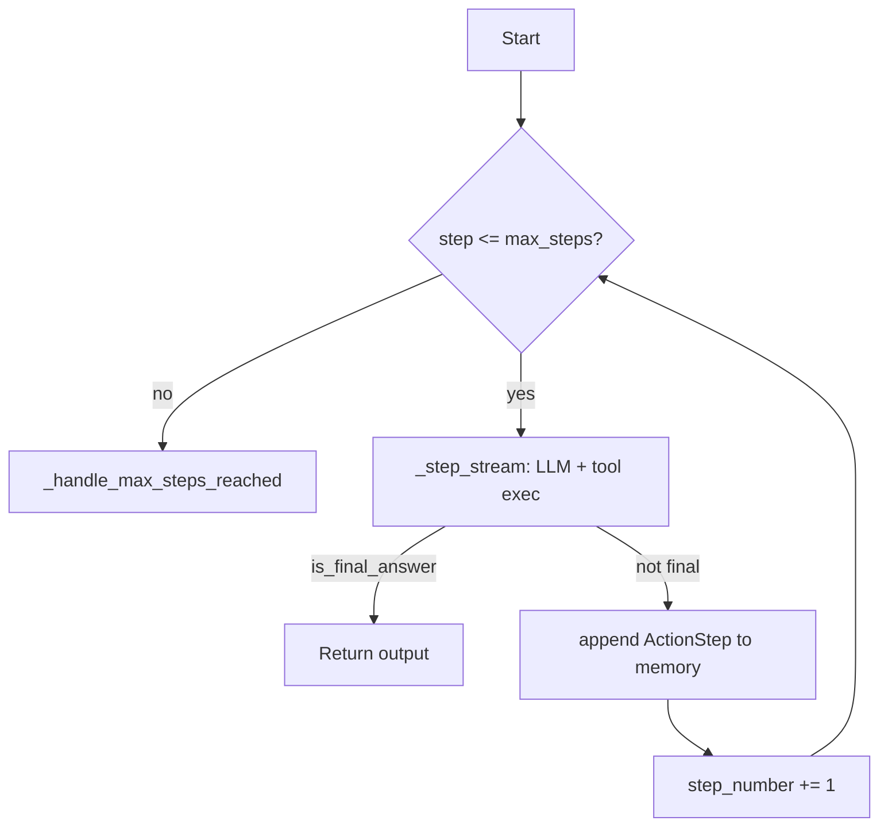

```python
while not returned_final_answer and step_number <= max_steps:
    action_step = ActionStep(step_number=step_number)
    for output in self._step_stream(action_step):
        if isinstance(output, ActionOutput) and output.is_final_answer:
            returned_final_answer = True
    self.memory.steps.append(action_step)
    step_number += 1
```

Two agent types share the same outer loop: `CodeAgent` (LLM writes Python) and `ToolCallingAgent` (JSON tool calls).

---

### DSPy (ReAct)
`for idx in range(max_iters)` — bounded for loop, not while

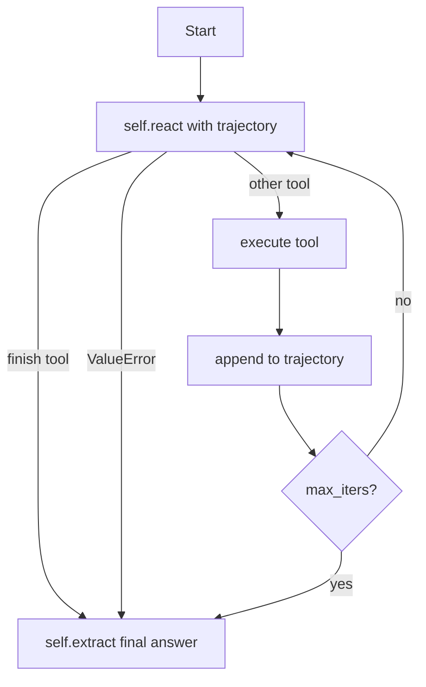

```python
trajectory = {}
for idx in range(max_iters):
    pred = self.react(trajectory=trajectory, **input_args)
    trajectory[f"thought_{idx}"]     = pred.next_thought
    trajectory[f"tool_name_{idx}"]   = pred.next_tool_name
    trajectory[f"observation_{idx}"] = self.tools[pred.next_tool_name](**pred.next_tool_args)
    if pred.next_tool_name == "finish":
        break
return self.extract(trajectory=trajectory, **input_args)
```

Unique: DSPy treats the loop as a *program to be compiled* — `self.react` prompts are auto-optimized.

---

### AutoGen (AssistantAgent)
`for loop_iteration in range(max_tool_iterations)`

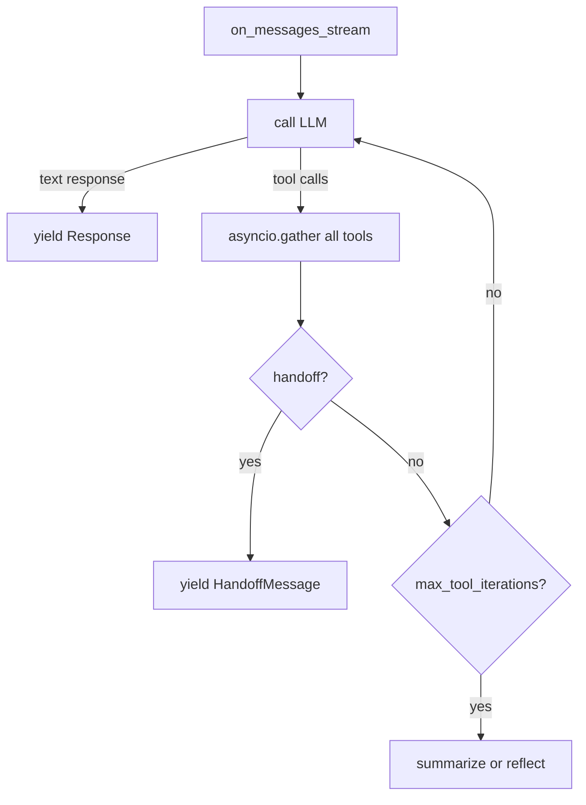

```python
for loop_iteration in range(max_tool_iterations):
    if isinstance(current_model_result.content, str):
        yield Response(...)
        return
    tool_results = await asyncio.gather(*[execute_tool(tc) for tc in current_model_result.content])
    await model_context.add_message(FunctionExecutionResultMessage(content=tool_results))
    current_model_result = await call_llm(model_context)
```

Team level: actor-model. `RoundRobinGroupChatManager` dispatches to next agent in round-robin.

---

### Strands Agents
Recursive async generator — no `while` loop

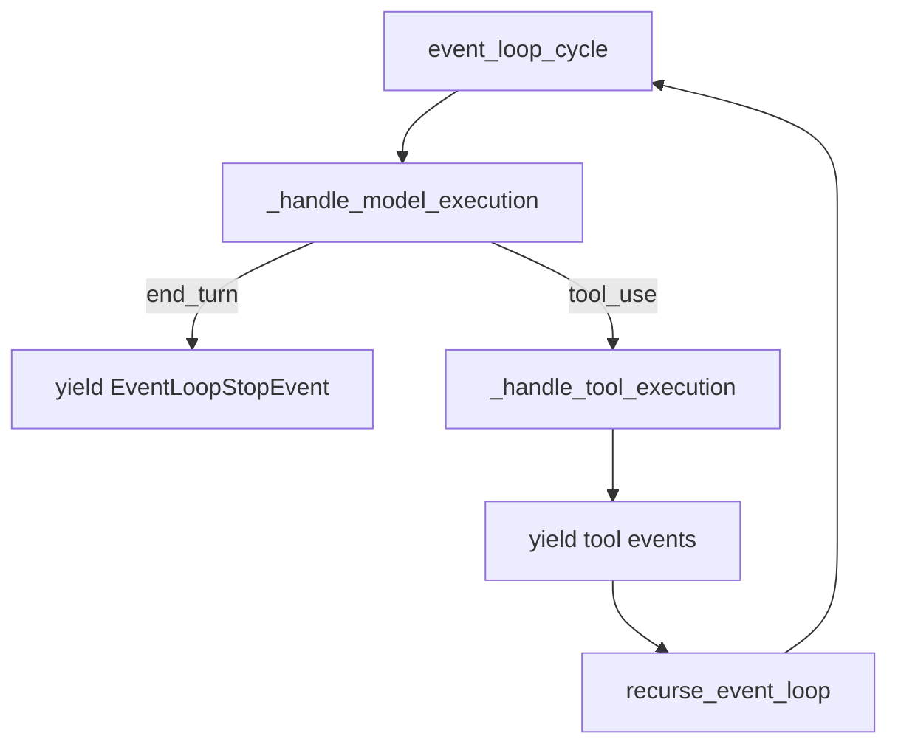

```python
async def event_loop_cycle(agent, invocation_state):
    stop_reason, message = await _handle_model_execution(...)
    if stop_reason == "tool_use":
        async for event in _handle_tool_execution(...):
            yield event
        async for event in recurse_event_loop(agent, invocation_state):
            yield event
        return
    yield EventLoopStopEvent(...)  # end_turn → done
```

The call stack IS the loop. First-class interrupt/resume — serialize mid-run state to S3/file, resume in a different process.

---

### Agno (formerly Phidata)
`while True:` inside `models/base.py`

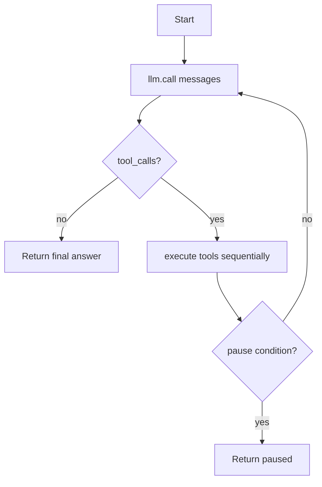

```python
while True:
    assistant_msg = llm.call(messages, tools=tools)
    messages.append(assistant_msg)
    if not assistant_msg.tool_calls:
        break
    for tool_call in assistant_msg.tool_calls:
        result = functions[tool_call.name](**tool_call.arguments)
        messages.append(Message(role="tool", content=str(result)))
    if any_pause_condition():
        break
```

---

### Haystack
`while exe_context.counter < self.max_agent_steps`

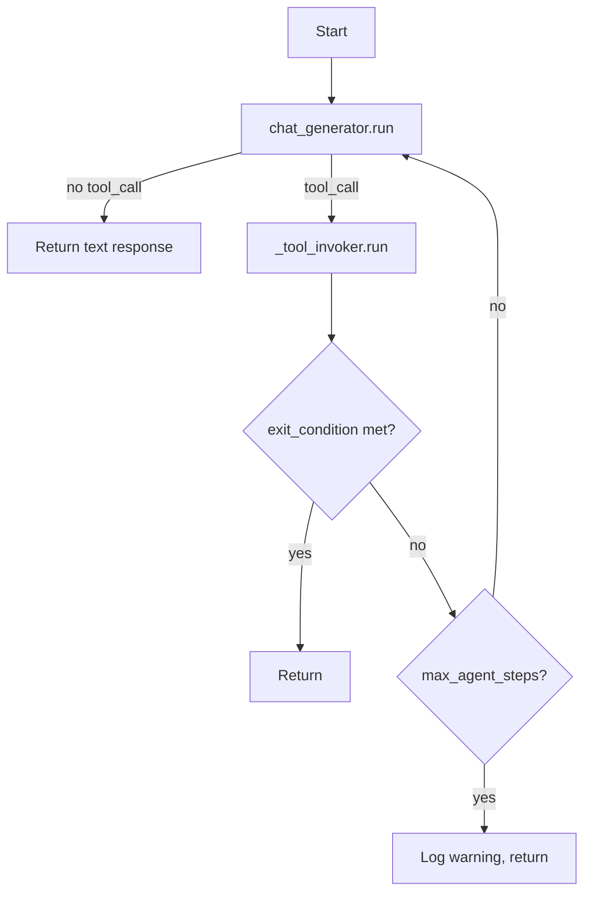

```python
while exe_context.counter < self.max_agent_steps:
    result = self.chat_generator.run(messages=state.data["messages"], tools=tools)
    if not any(msg.tool_call for msg in result["replies"]):
        break
    tool_result = self._tool_invoker.run(messages=result["replies"], state=state)
    if self._check_exit_conditions(...):
        break
    exe_context.counter += 1
```

The `Agent` is a `@component` but does NOT rely on pipeline cycling for its loop — the loop is entirely internal.

---

## Cross-Framework Synthesis

### The 4 loop primitives

| Primitive | Frameworks |
|-----------|-----------|
| `while True` / `while condition` | LangChain, OpenAI Agents, Agno, CrewAI, smolagents, Haystack |
| `for idx in range(max_iters)` | DSPy, AutoGen |
| Graph node traversal | LangGraph, PydanticAI, LlamaIndex |
| Recursive async generator | Strands Agents |

### The 3 stop signals

| Signal | Frameworks |
|--------|-----------|
| No tool calls in response | OpenAI Agents, Agno, Haystack, AutoGen, PydanticAI |
| Explicit finish token/tool | LangChain (`"Final Answer:"`), CrewAI, DSPy (`"finish"` tool), smolagents |
| Iteration cap only | All (as hard fallback) |

### The 1 essential state object

Every framework carries the same thing under different names:

```
messages: list of {role, content} dicts
```

| Framework | Name |
|-----------|------|
| LangChain | `intermediate_steps` |
| OpenAI Agents | `generated_items` |
| PydanticAI | `GraphAgentState.message_history` |
| CrewAI | `self.messages` |
| smolagents | `self.memory.steps` |
| DSPy | `trajectory` dict |
| AutoGen | `model_context` |
| Agno | `messages` list |
| Quark | `self.history` |

---

## What Quark Omits (and why)

| Feature | Frameworks that have it | Why Quark omits it |
|---------|------------------------|-------------------|
| Structured output validation | PydanticAI, Instructor | Out of scope — validate the output yourself |
| Persistence across runs | Agno, AutoGen, LangGraph | Pass history in yourself; don't hide state |
| Multi-agent handoffs | OpenAI Agents, AutoGen, CrewAI | Use `>>` to compose agents instead |
| Graph topology | LangGraph, PydanticAI | Linear pipelines cover 90% of use cases |
| Code execution | smolagents, AutoGen | A tool that runs code is just a tool |
| Prompt optimization | DSPy | Orthogonal to the loop — use DSPy on top if needed |
| Human-in-the-loop | OpenAI Agents, Agno | Not yet — planned |
